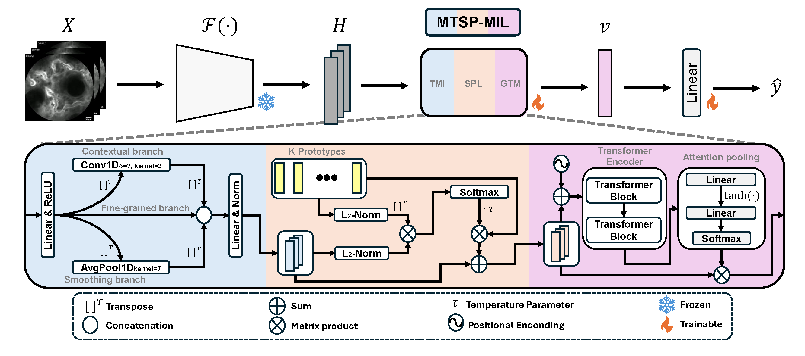

# Multi-scale Temporal Semantic Prototypes for Multiple Instance Learning (MTSP-MIL)

### TL;DR
Probe-based confocal laser endomicroscopy (pCLE) enables in-vivo assessment of microscopic disease activity in ulcerative colitis (UC) by visualizing intestinal barrier impairment. Although deep learning offers potential for pCLE-based UC diagnosis, most existing methods operate at the frame level, ignoring the temporal structure inherent to video sequences. To address this limitation, we propose Multi-scale Temporal Semantic Prototypes for multiple instance learning (MTSP-MIL), a novel time- and semantically-aware weakly-supervised model for pCLE video classification. Specifically, we integrate multi-scale temporal aggregation, learnable visual-semantic prototypes, and a transformer encoder with attention pooling to yield a robust video representation capturing local, global, and semantic dynamics. MTSP-MIL operates on frame-level features extracted by a foundation model. Empirical results validate the superior encoding capabilities of DINOv2 for pCLE and demonstrate that MTSP-MIL outperforms state-of-the-art MIL methods. Qualitatively, the learned prototypes effectively decouple anatomical semantics from noise, validating model interpretability.

<p align="center">
  
</p>


*<a href="https://scholar.google.com/citations?user=N8Y3mGAAAAAJ&hl=es" style="color:blue;">Ilán Carretero</a>, 
<a href="https://scholar.google.es/citations?user=4r9lgdAAAAAJ&hl=es&oi=ao" style="color:blue;">Pablo Meseguer</a>, 
<a href="https://www.researchgate.net/profile/Irene-Zammarchi" style="color:blue;">Irene Zammarchi</a>, 
<a href="https://scholar.google.com/citations?user=MYgrRXIAAAAJ&hl=it" style="color:blue;">Cecilia Pugliano</a>, 
<a href="https://scholar.google.es/citations?user=llZl5hAAAAAJ&hl=es&oi=ao" style="color:blue;">Giovanni Santacroce</a>, 
<a href="https://scholar.google.es/citations?user=9oLYv7sAAAAJ&hl=es&oi=ao" style="color:blue;">Bisi Bode Kolawole</a>, 
<a href="https://scholar.google.es/citations?user=u0grgIkAAAAJ&hl=es&oi=ao" style="color:blue;">Ujwala Chaudhari</a>,
<a href="https://scholar.google.es/citations?user=CPCZPNkAAAAJ&hl=es&oi=ao" style="color:blue;">Rocío del Amor</a>, 
<a href="https://scholar.google.es/citations?user=gJxnw0QAAAAJ&hl=es&oi=ao" style="color:blue;">Enrico Grisan</a>, 
<a href="https://scholar.google.com/citations?user=ATE1saYAAAAJ&hl=en" style="color:blue;">Marietta Iacucci</a>, 
<a href="https://scholar.google.com/citations?user=jk4XsG0AAAAJ&hl=es" style="color:blue;">Valery Naranjo</a>*


📜 <span style="color:red"><em>Submitted to <a href="https://2026.ieeeicip.org/" style="color:red;">ICIP'26</a></em></span> 

---

## PROJECT STRUCTURE

```text
.
├── aggregator/
│   └── MTSP_MIL.py                      # Main MTSP-MIL architecture & Ablation models
├── example_xlsx/
│   └── EXAMPLE_DATA_CV.xlsx             # Template illustrating the required Excel dataset format
├── figure/
│   └── mtsp_framework.pdf               # Architecture diagram
├── preprocessing/
│   ├── custom_stratified_k_folds.py     # Cross-validation splits (Group-Aware & Stratified)
│   ├── extract_features.py              # Frame extraction and foundational embedding (DINOv2)
│   ├── README.md                        # Preprocessing instructions
│   └── requirements.txt                 # Preprocessing specific dependencies
├── utils/
│   ├── explanation.py                   # Interpretability: Prototype and Attention frame extraction
│   ├── misc.py                          # General utilities, metrics, and data loaders
│   └── trainer.py                       # Training and validation loops
├── main_MTSP_mil.py                     # Standard training & evaluation pipeline
├── main_MTSP_mil_explanation.py         # Training pipeline + Visual interpretability generation
└── README.md                            # This file
```

---

## INSTALLATION AND USAGE

### 1. Runtime Environment

The project was developed and evaluated using the official NVIDIA PyTorch container to ensure reproducibility and GPU optimization:

- **Docker Image:** `nvcr.io/nvidia/pytorch:24.05-py3`

You can launch the environment using Docker, mount the project directory, and access the container shell. Once inside the environment, install the required specific dependencies:

```bash
pip install seaborn==0.13.2 openpyxl==3.1.5 decord==0.6.0
```

*(Note: if you plan to run feature extraction please go to `preprocessing/README.md` and follow the instructions to create the extract_feats_env environment).*

---

### 2. Data Formatting Requirements

Before executing the training pipelines, your metadata must be structured correctly. We provide a reference template located at `example_xlsx/EXAMPLE_DATA_CV.xlsx`. 

For the scripts to successfully map your pre-extracted embeddings to the ground truth and cross-validation partitions, ensure your `.xlsx` file includes at least the following columns:
- `SAMPLES`: Unique identifiers that perfectly match the names of your `.npy` embedding files and `.mp4` videos.
- `FOLD`: Integer values assigning each sample to a specific cross-validation fold.
- **Target Label (e.g., `ACTIVITY`)**: The specific column containing the ground-truth classes for the prediction task.

---

### 3. Standard Training & Evaluation (`main_MTSP_mil.py`)

This script executes the core Multiple Instance Learning pipeline. It loads the pre-extracted sequence embeddings, performs cross-validation based on the provided partitions, and computes quantitative metrics (e.g., AUC, Confusion Matrix) for each fold and the global aggregated results.

**Basic Execution:**
```bash
python main_MTSP_mil.py \
    --excel_path ./example_xlsx/EXAMPLE_DATA_CV.xlsx \
    --emb_dir_1 ./FIRST_DIRECTORY_CONTAINING_EMBEDDINGS \
    --emb_dir_2 ./SECOND_DIRECTORY_CONTAINING_EMBEDDINGS \
    --embedding_model dinov2_base \
    --mil_model MTSPMIL \
    --target ACTIVITY \
    --epochs 20 \
    --lr 5e-6 \
    --results_root ./RESULTS_FOLDER
```

**Key Arguments:**
- `--mil_model`: Selects the architecture. Options include `MTSPMIL` or ablation variants (`AB1_OnlyAttn`, `AB2_AttnTransformer`, etc.).
- `--target`: The specific label column to predict (e.g., `ACTIVITY`).
- `--loss`: Loss function choice (`crossentropy` or `focal_loss`).
- `--use_class_weights`: Set to `True` to handle class imbalances automatically.

---

### 4. Training + Interpretability (`main_MTSP_mil_explanation.py`)

This script expands upon the standard pipeline. In addition to training the model and computing metrics, it generates visual explanations for the validation set. It utilizes the `decord` library to rapidly map high-attention features back to the original `.mp4` files, extracting the top frames that trigger specific visual-semantic prototypes and global attention.

**Important:** You must modify lines `225 and 226` inside the script to point to the directories containing your raw `.mp4` videos before running.

**Basic Execution:**
```bash
python main_MTSP_mil_explanation.py \
    --excel_path ./example_xlsx/EXAMPLE_DATA_CV.xlsx \
    --emb_dir_1 ./FIRST_FOLDER_WITH_EMBEDDINGS \
    --emb_dir_2 ./SECOND_FOLDER_WITH_EMBEDDINGS \
    --embedding_model dinov2_base \
    --target ACTIVITY \
    --results_root ./RESULTS_FOLDER
```

**Output:**
Visual explanations will be saved inside your results directory under `explanations/fold_X_val/videos/`. Each video sample will contain:
- `imp_frames/`: Top global attention frames.
- `prototypes/`: Subfolders showing the specific frames that maximally activated each semantic prototype.
- `classification/`: Detailed Excel logs mapping attention scores and prototype activations.